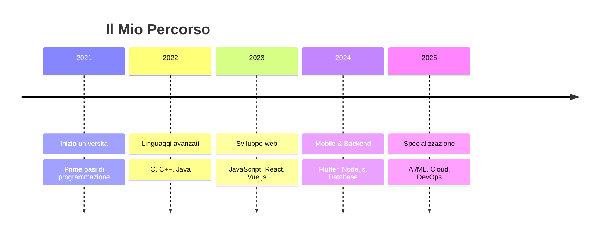

<div align="center">
  
  # 👋 Ciao! Sono **Yuri Romano**
  
  
  
  ### 🎓 Università di Genova - DIBRIS
  *Dipartimento di Informatica, Bioingegneria, Robotica e Ingegneria dei Sistemi*
  
  <p>
    
    
    
  </p>

</div>

---

## 🚀 **Chi Sono**

> *Sono uno studente di informatica appassionato di sviluppo software, sempre alla ricerca di nuove sfide tecnologiche e opportunità di crescita professionale.*

<div align="center">
  
  ```ascii
  ┌─────────────────────────────────────┐
  │  💻 Code • 🔍 Learn • 🚀 Build     │
  │                                     │
  │  "Il codice è poesia in movimento"  │
  └─────────────────────────────────────┘
  ```
  
</div>

---

## 🛠️ **Stack Tecnologico**

<details>
<summary>🔥 <strong>Linguaggi di Programmazione</strong></summary>
<br>

<div align="center">

| Linguaggio | Livello | Utilizzo |
|------------|---------|----------|
|  | ⭐⭐⭐⭐ | Programmazione di sistema |
|  | ⭐⭐⭐⭐ | Algoritmi e strutture dati |
|  | ⭐⭐⭐⭐⭐ | Sviluppo enterprise |
|  | ⭐⭐⭐⭐ | Data Science & Automation |
|  | ⭐⭐⭐⭐ | Sviluppo web moderno |
|  | ⭐⭐⭐ | Applicazioni desktop |
|  | ⭐⭐⭐ | Backend web |

</div>

</details>

<details>
<summary>🎨 <strong>Frontend & Mobile</strong></summary>
<br>

<div align="center">


**Specializzazioni:**
- 📱 Sviluppo di app mobile cross-platform
- 🎨 UI/UX Design responsivo
- ⚡ Single Page Applications (SPA)

</div>

</details>

<details>
<summary>⚙️ <strong>Backend & Database</strong></summary>
<br>

<div align="center">


**Competenze Backend:**
- 🔐 Autenticazione e autorizzazione
- 🗄️ Progettazione database relazionali e NoSQL
- 🌐 API RESTful e GraphQL

</div>

</details>

<details>
<summary>🔧 <strong>Strumenti & DevOps</strong></summary>
<br>

<div align="center">


</div>

</details>

---

## 🎯 **Progetti in Evidenza**

<div align="center">
  
### 🌟 Progetti che Raccontano la Mia Storia

</div>

<table>
<tr>
<td width="50%">

### 🚀 [DibrisPlus](https://github.com/yuriromano02/dibrisplus)

> **Innovazione Universitaria**

Un progetto che migliora l'esperienza studentesca attraverso soluzioni tecnologiche avanzate per il Dipartimento DIBRIS.

**🔧 Tech Stack:**
- Frontend moderno
- UX/UI ottimizzata
- Integrazione API

**🎯 Impact:** Semplificazione dei processi universitari

</td>
<td width="50%">

### 🎨 [Portfolio Personale](https://yuriromano02.github.io/)

> **Vetrina Digitale**

Il mio spazio online dove mostro progetti, competenze e la mia crescita professionale come sviluppatore.

**🔧 Tech Stack:**
- HTML5, CSS3, JavaScript
- Design responsivo
- Animazioni moderne

**🎯 Impact:** Presentazione professionale online

</td>
</tr>
<tr>
<td width="50%">

### 📚 [Comic App](https://github.com/YuriRomano02/comicapp)

> **Mobile Innovation**

Un'applicazione mobile sviluppata in Flutter per la gestione e lettura di fumetti digitali con un'esperienza utente coinvolgente.

**🔧 Tech Stack:**
- Flutter/Dart
- State Management
- Local Storage

**🎯 Impact:** Digitalizzazione del mondo dei fumetti

</td>
<td width="50%">

### 🔜 **Prossimi Progetti**

> **In Arrivo...**

- 🤖 Progetto AI/ML
- 🌐 Piattaforma Web3
- 📊 Dashboard Analytics

Sempre alla ricerca di nuove sfide tecnologiche!

</td>
</tr>
</table>

---

## 📊 **GitHub Stats**

<div align="center">
  
  
  

</div>

<div align="center">
  
  
  
</div>

<div align="center">
  
  
  
</div>

---

## 🎓 **Percorso Formativo**

<div align="center">



</div>

---

## 🌟 **Soft Skills**

<div align="center">

| 💡 **Creatività** | 🤝 **Collaborazione** | 🎯 **Problem Solving** | 📚 **Apprendimento** |
|:-----------------:|:--------------------:|:---------------------:|:-------------------:|
| Soluzioni innovative | Team work efficace | Approccio analitico | Curiosità continua |
| Pensiero laterale | Comunicazione chiara | Debugging avanzato | Adattabilità rapida |

</div>

---

## 🤝 **Connettiamoci!**

<div align="center">
  
  ### 💬 *"La tecnologia è meglio quando avvicina le persone"* - Matt Mullenweg
  
  <br>
  
  [](https://yuriromano02.github.io/)
  [](https://www.linkedin.com/in/yuri-romano-a2587a28b/)
  [](https://instagram.com/yuri.rmn)
  [](mailto:romanoyuri113@gmail.com)
  
  <br>
  
  > **📫 Come raggiungermi:**
  > - 💼 Per collaborazioni professionali: [LinkedIn](https://www.linkedin.com/in/yuri-romano-a2587a28b/)
  > - 📧 Per progetti interessanti: romanoyuri113@gmail.com
  > - 🌐 Per vedere il mio lavoro: [Portfolio](https://yuriromano02.github.io/)

</div>

---

<div align="center">
  
  ### ✨ *Grazie per aver visitato il mio profilo!*
  
  
  
  <br>
  
  **💡 Fun Fact:** Amo connettermi con persone diverse - se vuoi dire ciao, sarò felice di conoscerti! 😊
  
  <sub>Made with ❤️ by Yuri Romano • Last updated: Settembre 2025</sub>
  
</div>
